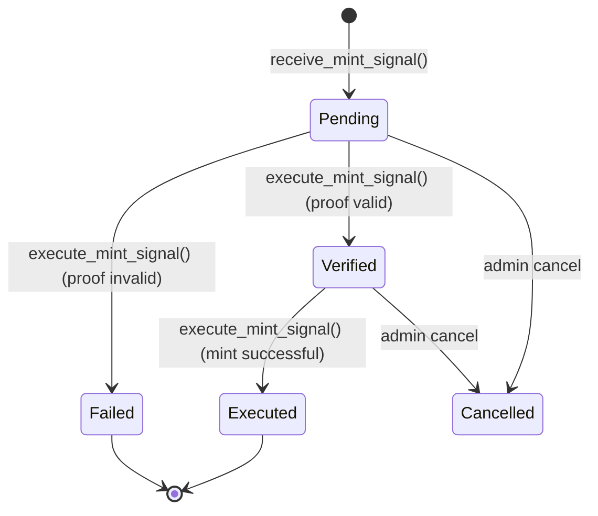
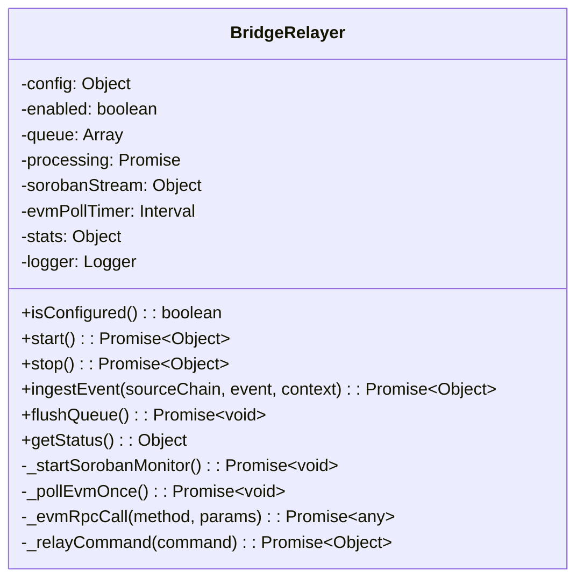

# Bridge Receiver Architecture

## Overview

The **Bridge Receiver** is the Soroban-side endpoint of SoroMint's cross-chain bridge. When a user locks or burns tokens on an external chain (Ethereum, BSC, Polygon, Avalanche, Arbitrum, Optimism, or Base), an off-chain relayer detects the event, normalizes it, and submits a mint signal to the `BridgeReceiverContract`. The contract stores the signal, verifies it, and mints the corresponding tokens on Soroban for the recipient.

This document explains the end-to-end data flow, on-chain contract mechanics, off-chain relayer design, and backend API integration.

## System Context

```
┌─────────────────────────────────────────────────────────────────────┐
│                         External Chains (EVM)                       │
│  Ethereum │ BSC │ Polygon │ Avalanche │ Arbitrum │ Optimism │ Base  │
│                                                                     │
│  User locks/burns tokens → Bridge contract emits event              │
└───────────────────────────────┬─────────────────────────────────────┘
                                │
                                │ 1. Event detected by relayer
                                ▼
┌─────────────────────────────────────────────────────────────────────┐
│                      Off-Chain Backend (Node.js)                     │
│                                                                     │
│  ┌──────────────────┐    ┌──────────────────┐    ┌───────────────┐ │
│  │ Bridge Relayer   │───▶│  REST API        │◀───│  Frontend     │ │
│  │ (bridge-relayer) │    │  (bridge-routes) │    │  (future)     │ │
│  └────────┬─────────┘    └──────────────────┘    └───────────────┘ │
│           │                                                        │
│           │ 2. Relay command                                        │
│           ▼                                                        │
│  ┌──────────────────┐                                              │
│  │ Event Indexer    │                                              │
│  │ (event-indexer)  │                                              │
│  └────────┬─────────┘                                              │
│           │                                                        │
│           │ 3. Index events from Soroban                            │
│           ▼                                                        │
│  ┌──────────────────┐                                              │
│  │ MongoDB          │                                              │
│  │ (SorobanEvent)   │                                              │
│  └──────────────────┘                                              │
└─────────────────────────────────────────────────────────────────────┘
                                │
                                │ 4. Submit mint signal
                                ▼
┌─────────────────────────────────────────────────────────────────────┐
│                          Soroban Network                            │
│                                                                     │
│  ┌──────────────────────────────────────────────────────────────┐  │
│  │              BridgeReceiverContract                           │  │
│  │                                                              │  │
│  │  receive_mint_signal() → stores Pending signal              │  │
│  │  execute_mint_signal() → verifies proof, mints tokens        │  │
│  └──────────────────────────┬───────────────────────────────────┘  │
│                             │                                       │
│                             │ 5. Mint tokens                         │
│                             ▼                                       │
│  ┌──────────────────────────────────────────────────────────────┐  │
│  │              Token Contract (SEP-41)                          │  │
│  │                                                              │  │
│  │  mint(recipient, amount)                                     │  │
│  └──────────────────────────────────────────────────────────────┘  │
└─────────────────────────────────────────────────────────────────────┘
```

## Detailed Data Flow

The bridge operates in five phases across three trust domains: the external EVM chain, the off-chain relayer, and the Soroban network.

### Phase 1: Source Chain Event

A user initiates a cross-chain transfer by locking or burning tokens on an EVM chain.

```
User Wallet (Ethereum)
    │
    │ Lock(amount, sorobanRecipient)
    ▼
Bridge Contract (EVM)
    │
    │ Emits: TokensLocked(txHash, recipient, amount, sourceChain)
    ▼
EVM Blockchain
```

The EVM bridge contract emits a standardized log event containing:
- `txHash`: The source transaction hash
- `recipient`: The Soroban address that should receive the minted tokens
- `amount`: The quantity of tokens locked or burned
- `sourceChain`: The originating chain identifier

### Phase 2: Off-Chain Relayer Detection

The `BridgeRelayer` service (`server/services/bridge-relayer.js`) monitors the EVM chain for bridge events.

```javascript
// EVM polling via eth_getLogs
const logs = await this._evmRpcCall('eth_getLogs', [{
  address: evmBridgeAddress,
  fromBlock: startBlock,
  toBlock: 'latest',
}]);
```

For each log returned, the relayer calls `ingestEvent()`, which:

1. Normalizes the heterogeneous event schema into a unified relay command via `buildRelayCommand()`
2. Classifies the action into an action family (`LOCK`, `RELEASE`, `MINT`, `BURN`, `TRANSFER`)
3. Maps the source action to a target action (e.g., `LOCK` → `mint`)
4. Queues the command for execution

### Phase 3: Command Normalization

The `buildRelayCommand()` function handles the fact that different EVM bridges emit events with different field names:

```javascript
// Extract asset symbol from multiple possible fields
const assetSymbol = pickFirst(
  event.symbol,
  event.assetSymbol,
  event.token,
  event.details?.symbol,
  event.args?.symbol
);
```

The normalized command contains:

```javascript
{
  bridgeId: string,           // Deterministic ID for deduplication
  sourceChain: string,        // "evm"
  targetChain: string,        // "soroban"
  sourceAction: string,       // Normalized action from source
  targetAction: string,       // Mapped action for target
  asset: {
    symbol: string,
    contractId: string
  },
  amount: string,
  recipient: string,
  sender: string,
  sourceTxHash: string,
  metadata: {
    sourceEventId: string,
    sourceChainName: string,
    targetChainName: string,
    actionFamily: string,
    actor: string,
    timestamp: string
  },
  originalEvent: object
}
```

### Phase 4: Relay Execution

The queued command is dispatched to a configurable relay endpoint:

```javascript
const targetUrl =
  command.targetChain === SOURCE_CHAINS.EVM
    ? this.config.evmRelayUrl || this.config.relayEndpointUrl
    : this.config.sorobanRelayUrl || this.config.relayEndpointUrl;

await fetch(targetUrl, {
  method: 'POST',
  headers: {
    'Content-Type': 'application/json',
    'X-SoroMint-Bridge-Id': command.bridgeId,
  },
  body: JSON.stringify(command),
});
```

In the current architecture, the relay endpoint is an external service. The backend does not directly invoke `receive_mint_signal` or `execute_mint_signal` on the BridgeReceiver contract. This separation allows the relay logic to be implemented in any language or runtime.

### Phase 5: On-Chain Minting

Once the relay endpoint processes the command, it submits a transaction to Soroban calling the `BridgeReceiverContract`:

```
receive_mint_signal(
    relayer: Address,
    source_chain: SourceChain,
    source_tx_hash: BytesN<32>,
    recipient: Address,
    amount: i128,
    nonce: u64,
    verification_proof: Bytes
) -> u64
```

The contract performs these checks:

1. **Authorization**: Verifies the caller is an authorized relayer
2. **Replay protection**: Confirms the source transaction hash has not been processed
3. **Proof validation**: Checks that the verification proof is non-empty (simplified; production requires Merkle/multisig/ZK proof verification)
4. **State update**: Stores the signal with `Pending` status and emits `sig_recv`

Later, an executor calls:

```
execute_mint_signal(relayer: Address, signal_id: u64) -> bool
```

This function:
1. Loads the signal from storage
2. Verifies the proof (currently placeholder)
3. Marks the source transaction as processed
4. Updates status to `Executed`
5. Emits `sig_exec`
6. Calls `token_contract.mint(recipient, amount)` (production implementation)

## Smart Contract Architecture

### Contract Location

`contracts/bridge_receiver/src/bridge_receiver.rs`

### Data Model

```rust
enum SourceChain {
    Ethereum,
    BinanceSmartChain,
    Polygon,
    Avalanche,
    Arbitrum,
    Optimism,
    Base,
    Other,
}

enum BridgeStatus {
    Pending = 1,
    Verified = 2,
    Executed = 3,
    Failed = 4,
    Cancelled = 5,
}

struct MintSignal {
    signal_id: u64,
    source_chain: SourceChain,
    source_tx_hash: BytesN<32>,
    recipient: Address,
    token_address: Address,
    amount: i128,
    nonce: u64,
    timestamp: u64,
    status: BridgeStatus,
    relayer: Address,
    verification_proof: Bytes,
}
```

### Storage Keys

| Key | Type | Purpose |
|-----|------|---------|
| `Signal(u64)` | `MintSignal` | Individual mint signals by ID |
| `NextSignalId` | `u64` | Auto-incrementing signal counter |
| `Relayer(Address)` | `bool` | Authorized relayer set |
| `ProcessedTx(BytesN<32>)` | `bool` | Replay-protection set |
| `TokenContract` | `Address` | Token contract to mint |
| `Admin` | `Address` | Contract administrator |
| `Paused` | `bool` | Emergency pause flag |

### Lifecycle State Machine



### Core Functions

| Function | Visibility | Purpose |
|----------|-----------|---------|
| `initialize(admin, token_contract)` | Admin | Sets up contract with admin and token address |
| `receive_mint_signal(...)` | Relayer | Stores a new mint signal as `Pending` |
| `execute_mint_signal(relayer, signal_id)` | Relayer | Verifies proof, mints tokens, marks as `Executed` |
| `add_relayer(admin, relayer)` | Admin | Adds an authorized relayer |
| `remove_relayer(admin, relayer)` | Admin | Removes an authorized relayer |
| `is_relayer(address)` | Public | Checks if address is an authorized relayer |
| `pause(admin)` | Admin | Pauses all mint operations |
| `unpause(admin)` | Admin | Resumes mint operations |
| `is_paused()` | Public | Returns pause state |
| `get_signal(signal_id)` | Public | Returns a single signal |
| `get_signal_count()` | Public | Returns total number of signals |
| `get_signals(start_id, limit)` | Public | Returns paginated signals |
| `is_tx_processed(tx_hash)` | Public | Checks replay protection |

### Events

| Event | Trigger |
|-------|---------|
| `sig_recv` | Signal received via `receive_mint_signal` |
| `sig_vrfy` | Signal verified in `execute_mint_signal` |
| `sig_exec` | Signal executed and tokens minted |
| `sig_fail` | Signal failed verification |
| `rel_add` | Relayer added |
| `rel_rem` | Relayer removed |
| `paused` | Contract paused |
| `unpaused` | Contract unpaused |

## Off-Chain Backend Architecture

### Bridge Relayer Service

**File**: `server/services/bridge-relayer.js`

The `BridgeRelayer` class is a singleton that manages the full lifecycle of cross-chain event monitoring and relay.



#### Configuration

| Environment Variable | Purpose | Default |
|---------------------|---------|---------|
| `BRIDGE_RELAYER_ENABLED` | Enable/disable the relayer | `false` |
| `BRIDGE_RELAYER_DIRECTION` | `both`, `evm-to-soroban`, `soroban-to-evm` | `both` |
| `BRIDGE_SOROBAN_ACCOUNT_ID` | Soroban account for contract calls | — |
| `BRIDGE_SOROBAN_RPC_URL` | Soroban RPC endpoint | — |
| `BRIDGE_EVM_RPC_URL` | EVM JSON-RPC endpoint | — |
| `BRIDGE_EVM_BRIDGE_ADDRESS` | Bridge contract address on EVM | — |
| `BRIDGE_EVM_START_BLOCK` | Starting block for EVM polling | `0` |
| `BRIDGE_POLL_INTERVAL_MS` | EVM poll interval in milliseconds | `15000` |
| `BRIDGE_RELAY_ENDPOINT_URL` | Fallback relay endpoint | — |
| `BRIDGE_EVM_RELAY_URL` | EVM-specific relay endpoint | — |
| `BRIDGE_SOROBAN_RELAY_URL` | Soroban-specific relay endpoint | — |

> **Note**: These variables are consumed by `bridge-relayer.js` but are **not validated** by `env-config.js`. The server starts even if they are missing; the relayer simply remains unconfigured.

### REST API Endpoints

**File**: `server/routes/bridge-routes.js`

All endpoints require authentication (`authenticate` middleware).

| Method | Endpoint | Purpose |
|--------|----------|---------|
| `GET` | `/api/bridge/relayer/status` | Return relayer status, queue metrics, and masked config |
| `POST` | `/api/bridge/relayer/start` | Start EVM poller and Soroban monitor |
| `POST` | `/api/bridge/relayer/stop` | Stop all monitors and flush queue |
| `POST` | `/api/bridge/relayer/simulate` | Inject a synthetic event for dry-run testing |
| `POST` | `/api/bridge/relayer/ingest` | Production event ingestion endpoint |
| `POST` | `/api/bridge/relayer/reset` | Admin-only: reset queue and stats |

### Request Validation

**File**: `server/validators/bridge-validator.js`

Uses Zod schemas to validate:

- `bridgeEventSchema`: Validates `sourceChain` (`soroban` or `evm`), `event` payload (asset, amount, action, recipient, sender, transaction metadata), and optional `metadata`
- `bridgeStatusSchema`: Validates `detailed` query parameter

### Event Indexer Integration

The generic event indexer (`server/services/event-indexer.js`) can pick up Bridge Receiver contract events (`sig_recv`, `sig_vrfy`, `sig_exec`, etc.) from Soroban RPC and store them in MongoDB via the `SorobanEvent` model. These are served through `server/routes/soroban-event-routes.js`.

## Security Considerations

### 1. Relayer Authorization

Only addresses explicitly added via `add_relayer()` can submit or execute mint signals. Unauthorized calls are rejected at the contract level.

### 2. Replay Protection

Every source chain transaction hash is stored in the `ProcessedTx` set. Attempting to process the same hash twice panics the contract, preventing double-minting.

### 3. Emergency Pause

The admin can pause all mint operations instantly. While paused, `receive_mint_signal` and `execute_mint_signal` reject all calls.

### 4. Proof Verification

The current implementation uses simplified verification (`!verification_proof.is_empty()`). For production, implement:

- **Merkle Proof Verification**: Validate that the source transaction is included in a known Merkle root
- **Multi-Signature Verification**: Require signatures from multiple trusted validators
- **Light Client Verification**: Integrate a Soroban light client to verify EVM block headers
- **Zero-Knowledge Proofs**: Use ZK proofs for privacy-preserving bridges

### 5. Relayer Trust Model

Relayers are currently trusted entities. Consider implementing:

- Multi-relayer consensus before minting
- Stake/slashing mechanisms to deter misbehavior
- Fraud proofs and challenge periods
- Timelock delays for large amounts

## Current Limitations

| Limitation | Description |
|------------|-------------|
| Simplified proof verification | `execute_mint_signal` only checks that the proof is non-empty |
| Minting stubbed | `token_contract.mint()` call is commented out in the contract |
| No direct RPC integration | Backend does not call `receive_mint_signal` directly; relies on external relay endpoint |
| Soroban monitor placeholder | `_startSorobanMonitor()` logs initialization but does not stream events |
| Single token contract | Contract is initialized with one token address; multi-token support requires contract updates |
| No frontend UI | No bridge-specific UI exists in the client |

## Testing

### Contract Tests

```bash
cd contracts/bridge_receiver
cargo test
```

Covers initialization, pause/unpause, relayer management, signal receive/execute, replay protection, paused state rejection, invalid amount rejection, batch queries, and unauthorized relayer rejection.

### Backend Tests

```bash
cd server
npm test -- bridge
```

Covers:
- `bridge-relayer.test.js`: Command building, event normalization, relayer config, queue flush, singleton behavior
- `bridge-routes.test.js`: Status, start/stop, simulate, ingest, admin-reset endpoints

## Future Enhancements

1. **Direct Soroban RPC Integration**: Replace the external relay endpoint with direct `receive_mint_signal` calls from the backend
2. **Advanced Proof Verification**: Implement Merkle proofs, multisig verification, or ZK proofs in the contract
3. **Multiple Token Contracts**: Support minting multiple token types through a single receiver
4. **Batch Signal Processing**: Process multiple signals in a single transaction for efficiency
5. **Fee Mechanism**: Charge relayers a fee for processing signals
6. **Slashing**: Penalize malicious relayers
7. **Outbound Bridge**: Complete the `proof_of_burn` contract for Soroban-to-EVM bridging
8. **Frontend Bridge UI**: Add a bridge interface to the client for tracking cross-chain transfers

## Related Documentation

- [Token Factory Pattern](../factory-pattern.md)
- [Event Indexer](../event-indexer.md)
- [Contract Events](../contract-events.md)
- [Contract API](../contract-api.md)

## License

Part of the SoroMint project.
